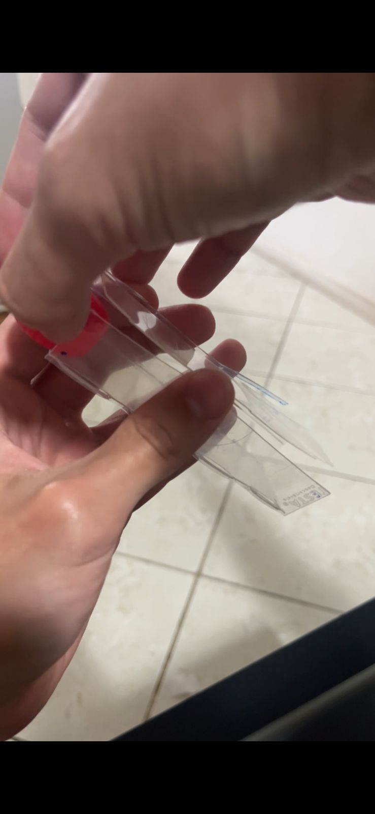
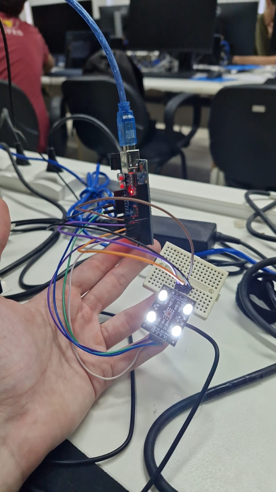
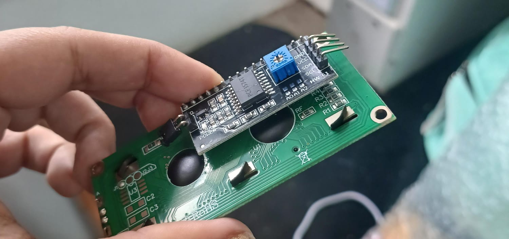
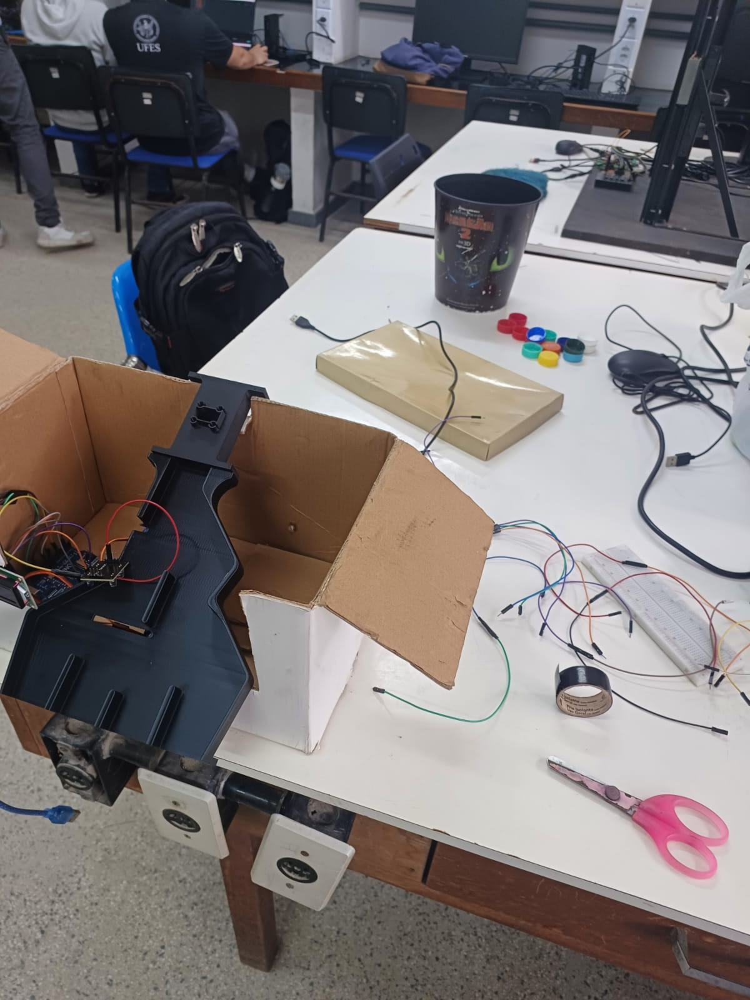
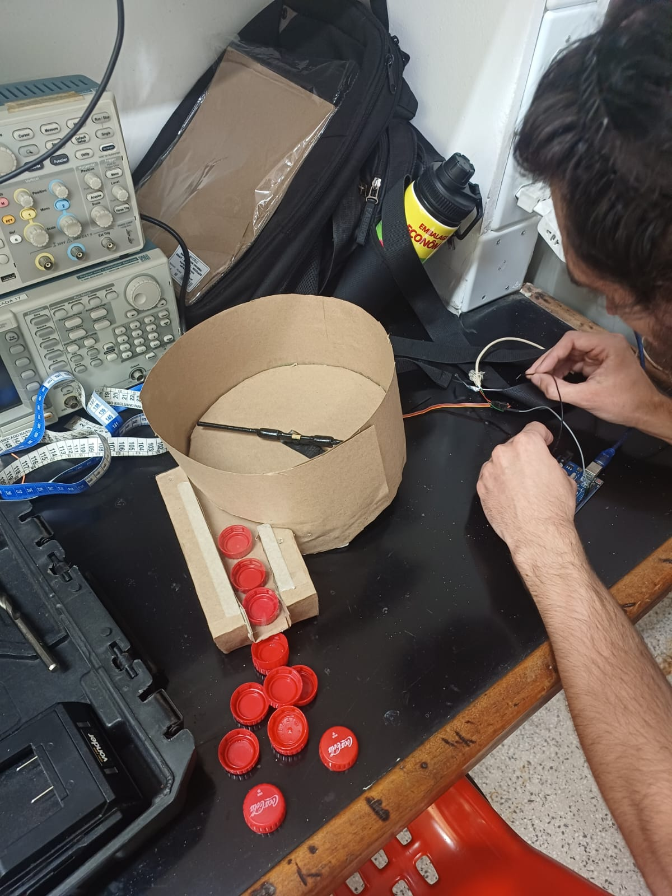
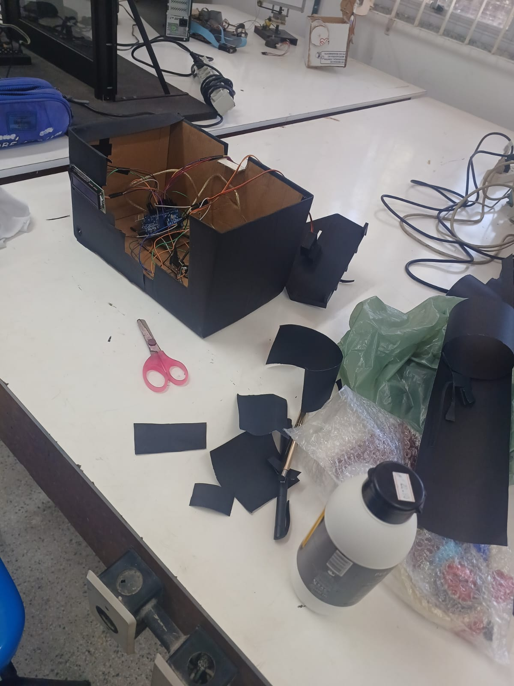
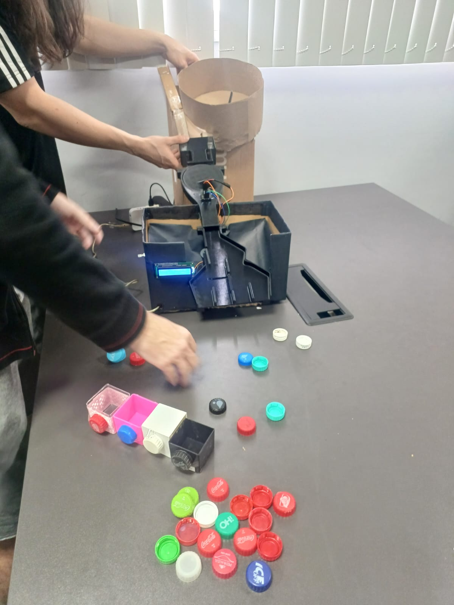
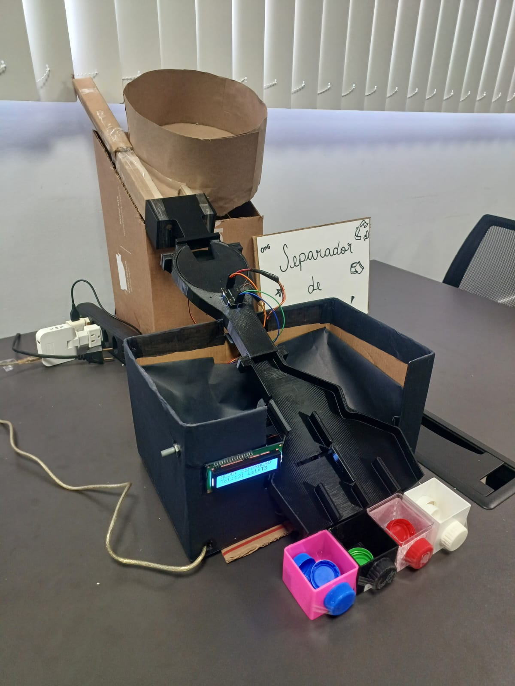
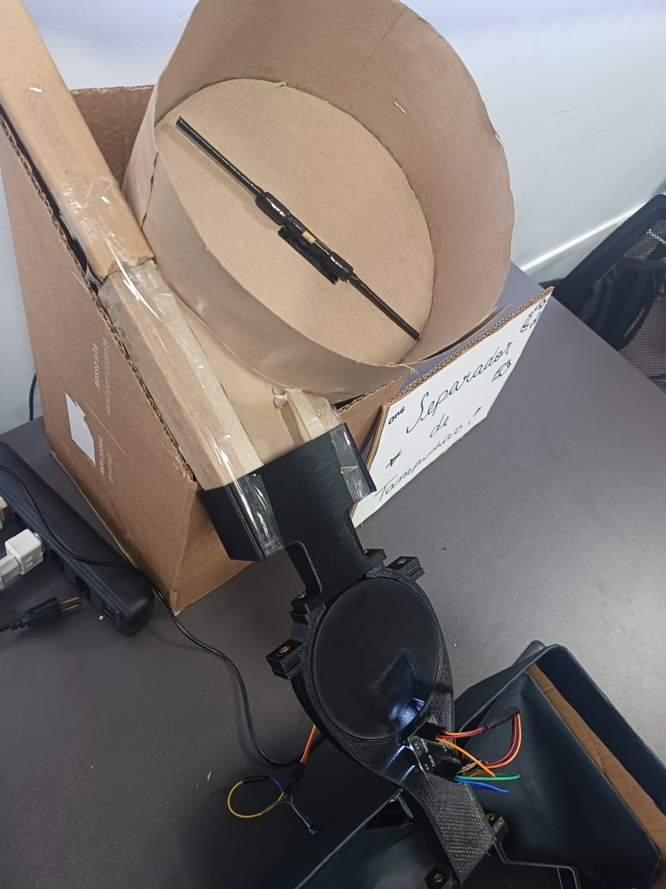

<h1 align="center">♻️ Separador de Tampinhas ♻️</h1>
<h3 align="center">Grupo 4</h3>

<div align="center">


  


</div>

---

## 📝 Descrição do Projeto  

O **Grupo 4** desenvolveu um **Separador Automático de Tampinhas de Garrafa PET por Cor**. O protótipo possui um **mecanismo alimentador**, no qual o usuário deposita várias tampinhas. Esse mecanismo organiza e **enfileira as tampinhas**, permitindo que elas passem pelo sensor de cores, garantindo uma leitura precisa. Após a leitura, o **Arduino Uno** processa os valores obtidos pelo sensor, identifica a cor da tampinha por meio de perfis previamente calibrados e aciona **servomotores**, responsáveis por direcioná-la ao compartimento correspondente. O sistema também conta com um **display LCD** com módulo I2C, utilizado para fornecer e coletar informações ao usuário durante a calibração.  

---  

## 🎯 Objetivo  

Desenvolver um sistema automatizado capaz de identificar e classificar tampinhas plásticas por cor, aplicando conceitos de sistemas embarcados, eletrônica, automação e programação para tornar o processo de separação mais eficiente e preciso.

---

## 💡 Motivação

A separação de tampinhas plásticas por cor é uma etapa importante do processo de reciclagem, pois aumenta a qualidade do material reciclado e facilita seu reaproveitamento. Quando diferentes cores são misturadas, o material obtido geralmente apresenta menor valor comercial e uma cor escura, dificultando sua reutilização em novos produtos.

Apesar de sua importância, esse processo ainda é realizado manualmente por diversas organizações, cooperativas e iniciativas sociais, tornando a atividade repetitiva, lenta e suscetível a erros. Além disso, a separação manual exige esforço físico constante e limita a quantidade de material que pode ser processada diariamente.

Além do benefício ambiental, a arrecadação de tampinhas possui um importante impacto social. Diversas **ONGs** utilizam a venda do material reciclável para financiar projetos beneficentes e ações de proteção ao meio ambiente. Entre elas destacam-se:

- **Tampinhas que Curam**: iniciativa que arrecada tampinhas plásticas para auxiliar no tratamento de crianças com câncer.
- **Ecopatas**: ONG que arrecada tampinhas plásticas e lacres de alumínio para contribuir com a preservação ambiental e o resgate de animais abandonados.
- **Tampinha do Bem**: projeto voltado à coleta e reciclagem de tampinhas, destinando os recursos obtidos para instituições sociais e ações de proteção animal.
- **Pontos de coleta**: como o instalado no Shopping Vitória (ES), que recebem tampinhas e lacres destinados posteriormente a projetos sociais e ambientais.

---


## 🌱 Impactos e ODSs


---

## ⚙️ Funcionamento Geral

O funcionamento ocorre em seis etapas principais:

1. O usuário deposita as tampinhas no compartimento superior.

2. O enfileirador organiza as tampinhas e libera apenas uma por vez.

3. A tampinha passa pelo sensor de cores, que realiza a leitura da sua cor.

4. O Arduino compara essa leitura com as cores previamente cadastradas.

5. O sistema identifica a cor correspondente.

6. Os servomotores direcionam a tampinha para o compartimento correto.
   
---

## 🛠️ Arquitetura do Sistema

O sistema foi dividido em dois subsistemas independentes, cada um executado por um Arduino Uno.

### * Enfileirador

O Enfileirador é responsável por organizar mecanicamente as tampinhas depositadas pelo usuário. Seu Arduino controla um servomotor que movimenta o mecanismo responsável por liberar a tampinhas no tubo de leitura.

### * Separador

Seu Arduino realiza a leitura do sensor de cor, identifica automaticamente a cor da tampinha, controla os servomotores responsáveis pelo direcionamento e gerencia toda a interface com o usuário através do display LCD e do encoder rotativo.

---

## 📁 Estrutura do Repositório

```text
Separador-de-Tampinhas/
├── Software/
│   ├── Enfileirador.ino
│   └── Separador.ino
│
├── Hardware/
│   ├── Modelos 3D/
│   └── Imagens/
│      
└── README.md
```
---

## 👶🏻 Como tudo começou...

<div align="center" style="display:flex; gap:20px;">
  
  
  
  
  
 
</div>

---

## 📷 Imagens do Projeto Final

<div align="center" style="display:flex; gap:20px;">
 
 
 
</div>

---

# 🧠 Software

O software do **Separador** foi desenvolvido utilizando uma máquina de estados composta por dois modos principais.

### Modo Operação

Neste modo o sistema permanece monitorando continuamente o sensor de cor.

Quando uma tampinha entra no tubo de leitura, o Arduino identifica essa alteração, realiza a leitura da cor e determina automaticamente qual compartimento deverá recebê-la.

Após a identificação, os servomotores são acionados e o display LCD atualiza as informações de operação.

### Modo Menu

Ao girar o encoder rotativo, o sistema entra automaticamente no modo de configuração.

Nesse modo o usuário pode:

- calibrar o tubo;
- calibrar cada tampinha;
- apagar toda a EEPROM.

Atualmente o sistema permite calibrar:

- **1 referência do tubo vazio** (utilizada para detectar a queda da tampinha);
- **3 perfis de cores distintos** (Tampa 1, Tampa 2 e Tampa 3).

Após alguns segundos sem interação, o sistema retorna automaticamente ao modo de operação.

---

## 🤖 Código do Separador

As principais funções do codigo do **Separador** (Separador.ino) são:

### setup()

Inicializa todos os periféricos do sistema, incluindo LCD, sensor de cores, encoder rotativo, servomotores e EEPROM.

Também realiza a leitura das calibrações armazenadas.

### loop()

Executa continuamente a máquina de estados do sistema.

Dependendo do modo atual, pode:

- monitorar o sensor de cores;
- controlar o menu;
- atualizar o display LCD;
- gerar os sinais PWM dos servomotores.

### lerRGB()

Seleciona sucessivamente os filtros vermelho, verde e azul do sensor de cor e realiza a leitura da frequência produzida pelo sensor.

### processarQueda()

Executa diversas leituras durante a passagem da tampinha, selecionando automaticamente a leitura mais representativa.

### identificarCor()

Compara a leitura atual com todos os perfis previamente calibrados e determina qual apresenta menor distância.

### moverServos()

Movimenta os servomotores para direcionar a tampinha ao compartimento correspondente.

### executarCalibracao()

Realiza o processo de calibração do tubo ou das tampinhas e armazena os dados na EEPROM.

### executarResetEEPROM()

Apaga todas as calibrações previamente armazenadas.

---

## 💻 Código do Enfileirador

O software do **Enfileirador** tem como única função controlar o servomotor responsável por organizar as tampinhas antes da etapa de identificação. Utilizando a biblioteca `Servo.h`, o programa alterna continuamente o sentido de rotação do servo por meio de comandos `servo.write()`, fazendo com que o mecanismo movimente as tampinhas e libere para o tubo de leitura. 

---

## 👥 Interface com o Usuário

Toda a interação entre o usuário e o sistema ocorre por meio de um display LCD 16×2 com comunicação I2C e de um encoder rotativo.

O display informa o estado atual do equipamento, auxilia durante o processo de calibração e apresenta mensagens de confirmação ao usuário.

Durante o funcionamento podem ser exibidas as seguintes telas.

### Tela de Inicialização

Logo após ligar o equipamento é apresentada uma tela de boas-vindas.

```text
SEPARADOR DE
TAMPINHAS
```
---

### Tela Principal

Após a inicialização, o sistema entra automaticamente no modo de separação.

```text
MODO: SEPARACAO
Tot:15 Lst:T2
```

Nessa tela são exibidas duas informações importantes:

- **Tot**: quantidade total de tampinhas classificadas desde que o sistema foi ligado.
- **Lst**: última tampinha identificada.

Os possíveis valores de **Lst** são:

| Valor | Significado |
|--------|-------------|
| T1 | Última tampinha identificada foi a Tampa 1 |
| T2 | Última tampinha identificada foi a Tampa 2 |
| T3 | Última tampinha identificada foi a Tampa 3 |
| Desc | Cor desconhecida (não corresponde a nenhuma cor calibrada) |
| Nenhuma | Nenhuma tampinha foi identificada desde a inicialização |

---

### Menu de Configuração

Ao girar o encoder rotativo o sistema entra automaticamente no menu.

```text
MENU:
TUBO
```

ou

```text
MENU:
Tampa 1
```

ou

```text
MENU:
Tampa 2
```

ou

```text
MENU:
Tampa 3
```

ou

```text
MENU:
RESET EEPROM
```

Quando um perfil já foi calibrado, o display apresenta:

```text
MENU:
Tampa 2 [OK]
```

A indicação **[OK]** significa que aquela calibração já está armazenada na EEPROM.

---

### Calibração

Durante a calibração do tubo:

```text
CALIBRANDO:
TUBO
```

Em seguida:

```text
Lendo Tubo...
```

O sistema realiza a leitura da referência do tubo vazio.

---

Durante a calibração das tampinhas:

```text
CALIBRANDO:
Tampa 1
```

Depois solicita cada uma das cinco passagens da tampinha.

```text
Solte tampa 1
Aguardando...
```

Após detectar corretamente a passagem:

```text
Capturado! OK.
```

Esse processo é repetido cinco vezes.

Ao final, o sistema calcula automaticamente a média das leituras obtidas e armazena o perfil na EEPROM.

---

### Salvamento

Após concluir a calibração é apresentada a mensagem:

```text
Salvo na EEPROM!
```

Isso indica que a calibração foi armazenada permanentemente na memória EEPROM.

---

### Reset da EEPROM

Quando o usuário seleciona a opção de apagar todas as calibrações, o display informa:

```text
LIMPANDO EEPROM...
```

Após concluir a operação:

```text
EEPROM Resetada!
```

Todas as referências de cores são apagadas e uma nova calibração poderá ser realizada.

---

# 🔌 Hardware

## 🪛 Materiais

**Microcontroladores**
- 1 Arduino Uno (Enfileirador)
- 1 Arduino Uno (Separador)
  
**Sensores**
- 1 Sensor de cores TCS230/TCS3200
  
**Atuadores**
- 3 Servomotores SG90 9g
- 1 Servomotor GOLD AMS5811G
  
**Interface**
- 1 Display LCD 16×2 com módulo I2C integrado
- 1 Encoder Decoder Rotacional KY-040
  
**Alimentação**
- Fontes externas 5V etc...
  
**Demais componentes**
- Jumpers
- Estruturas impressas em 3D
- Placa perfurada de fenolite
- Tampinhas de garrafa PET
- Papelão
- 4 mini compartimentos
- Materiais como: cartolina, papel kraft, cola, durex, palito etc..

---

## 🔌 Ligações

São apresentados abaixo os principais sinais utilizados pelo módulo **Separador**.

| Arduino | Dispositivo |
|----------|-------------|
| D3 | Servo 1 |
| D11 | Servo 2 |
| D13 | Servo 3 |
| D5 | OUT do sensor de cor |
| D4 | S0 do sensor de cor |
| D9 | S1 do sensor de cor |
| D6 | S2 do sensor de cor |
| D7 | S3 do sensor de cor |
| D2 | Encoder CLK |
| D8 | Encoder DT |
| D10 | Encoder SW |
| GND | GND Encoder |
| VCC | VCC Encoder |
| SDA | SDA LCD I2C |
| SCL | SCL LCD I2C |
| GND | GND LCD I2C |
| VCC | VCC LCD I2C |
| GND | GND Fonte Externa |

Demais conexões do circuito: distribuição da alimentação por meio de uma **placa perfurada de fenolite**, a **fonte externa de 5V** utilizada para alimentar os servomotores e o Arduino do Enfileirador, responsável pelo acionamento de um servomotor dedicado etc.

---

## 🖨 Modelos 3D

**Todas** as peças mecânicas do projeto foram modeladas no **Autodesk Inventor**.

Os modelos encontram-se na pasta `Hardware/Modelos 3D/` e são disponibilizados no formto .stl.

---

## 🌈 Sensor de Cor

O sistema utiliza o sensor de cores **TCS230/TCS3200**, responsável por realizar a identificação das tampinhas plásticas através da análise da luz refletida pela superfície de cada material.

Ele é um sensor óptico composto por uma matriz de fotodiodos e um conversor de corrente para frequência. Ele possui filtros internos que permitem selecionar a leitura das componentes de cor **vermelho (R), verde (G) e azul (B)**, além de uma leitura sem filtro.

O funcionamento do sensor ocorre da seguinte forma: uma fonte de luz interna ilumina o objeto posicionado à frente do sensor. A luz refletida pela tampinha atinge os fotodiodos, que geram uma corrente elétrica proporcional à intensidade luminosa recebida. Essa corrente é convertida internamente pelo circuito do sensor em um sinal digital de frequência.

Dessa forma, quanto maior a intensidade da cor selecionada, maior será a frequência do sinal de **saída (OUT)** gerado pelo sensor.

O Arduino não recebe diretamente valores de vermelho, verde e azul. Em vez disso, ele mede a frequência produzida pelo sensor para cada filtro de cor e utiliza esses valores para calcular uma representação RGB da tampinha analisada.

---

## 📋 Pré-requisitos

- Arduino IDE 2.x (ou superior);
- Driver da placa Arduino Uno (caso necessário);
- Bibliotecas da Arduino IDE:
  - Servo
  - EEPROM
  - Wire
  - LiquidCrystal_I2C
  - FreqCount
- Hardware descrito anteriormente.

---

## ▶️ Instruções de Execução

1. Monte os circuitos.
2. Grave o programa `Enfileirador.ino` no Arduino responsável pelo enfileiramento.
3. Grave o programa `Separador.ino` no Arduino responsável pela classificação.
4. Ligue a alimentação do sistema.
5. Realize a calibração do tubo pelo menu.
6. Calibre cada uma das tampinhas.
7. Inicie a operação automática do equipamento.

---

## 🚀 Evolução em Relação ao Pitch

Os objetivos propostos no pitch foram alcançados com sucesso. Além disso, durante o desenvolvimento do projeto foi possível ampliar o escopo inicialmente planejado.

Originalmente, o sistema previa apenas a identificação e separação das tampinhas por cor. No decorrer do desenvolvimento, observou-se a necessidade de organizar a alimentação das tampinhas para garantir mais agilidade. Como resultado, foi desenvolvido um segundo subsistema, denominado **Enfileirador de Tampinhas**, composto por um Arduino dedicado e um servomotor responsável por organizar e liberar as tampinhas.

---

## ⏳ Estado Atual do Projeto

✔️ Completo

**Progresso estimado: ~100%**

---

## 🎥 Vídeo Pitch

Um pitch do projeto está disponível no link abaixo:

🔗 [Clique aqui para assistir ao vídeo do projeto](https://www.youtube.com/watch?v=MaOEnb36ciA)

---

## 🏁 Conclusão

O projeto permitiu a aplicação prática de conceitos de eletrônica, programação embarcada e automação, proporcionando aprendizado técnico, trabalho em equipe e desenvolvimento de uma solução tecnológica integrada.

---

## 👩‍💻 Colaboradores

| <br><sub>André Silvares</sub> | <br><sub>Daniel Moulin</sub> |<br><sub>Larissa Fernandes</sub> | <br><sub>Rafael Santiago</sub> |
| :---: | :---: | :---: | :---: |
---

## 📌 Observação

O projeto possui caráter **acadêmico e experimental**, sendo desenvolvido para a
disciplina **Projeto Integrado de Computação II** da UFES, com foco na integração entre
software, hardware e sociedade.

---
